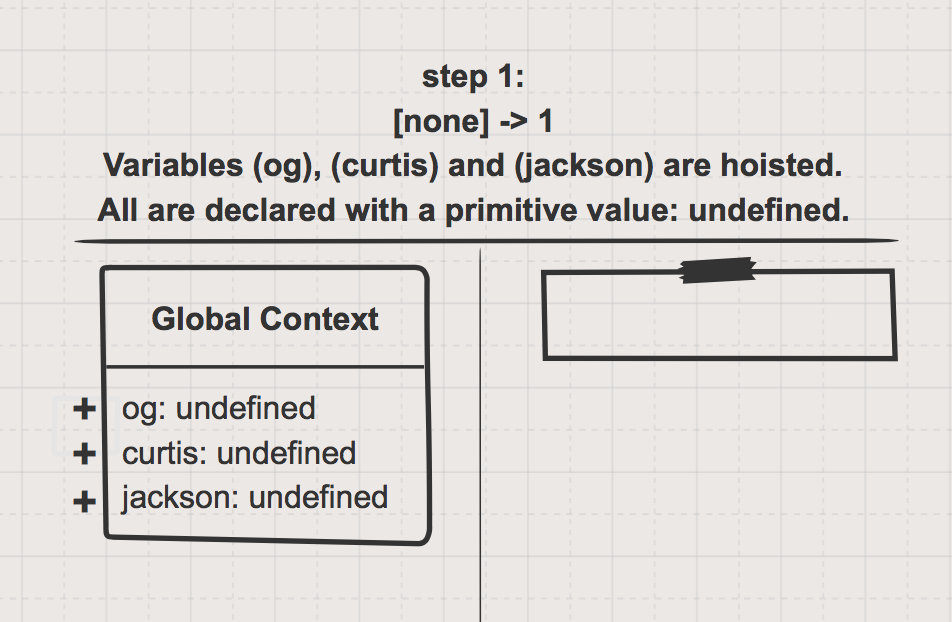
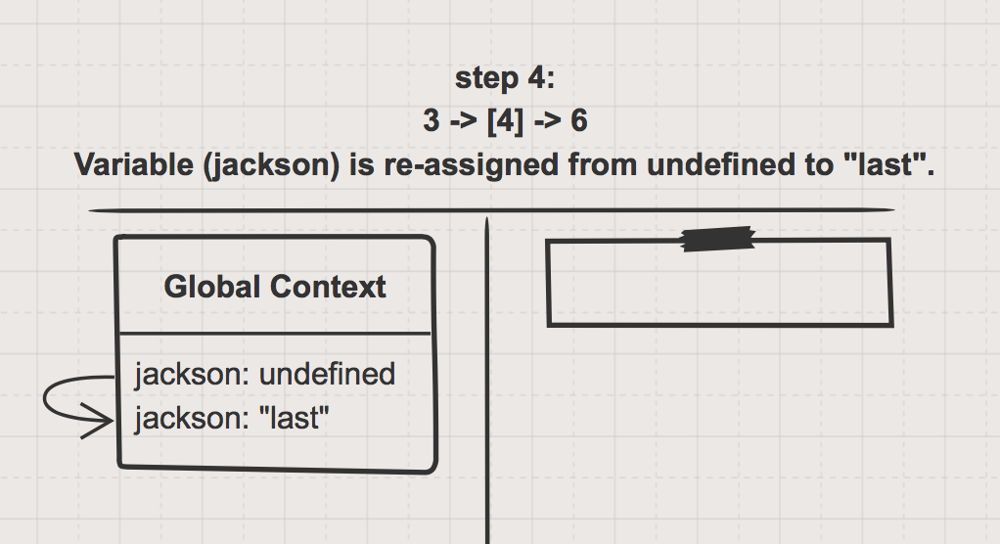

## Dots vs Brackets 

There are two primary ways to access properties in JavaScript objects:
* __Dot notation:__ direct access by key
* __Bracket notation:__ indirect access by value

These two types of access can be quite confusing at the beginning, but with a solid understanding of how variables & values work the mystery fades away. Knowing when to use one or the other can take some time and experience, but learning how they work is not so tricky with the right visualizations.

___
 
### The Code

```js
var og = {first: 'fifty', last: 'cent'};

var curtis = 'first';
var jackson = 'last';

console.log(og.first); 		// log: fifty
console.log(og.last); 		// log: cent

console.log(og[curtis]);	// log: fifty
console.log(og[jackson]);	// log: cent
```

[Live PyTut link](https://goo.gl/i14DE7)

[Gist for further study](https://gist.github.com/colevandersWands/69ac68ffd4c8b2da53a8297f2937d74c)

Direct vs Indirect access:


___

### The Sketches







___


___
___
### <a href="http://elewa.education/blog" target="_blank"></a>

