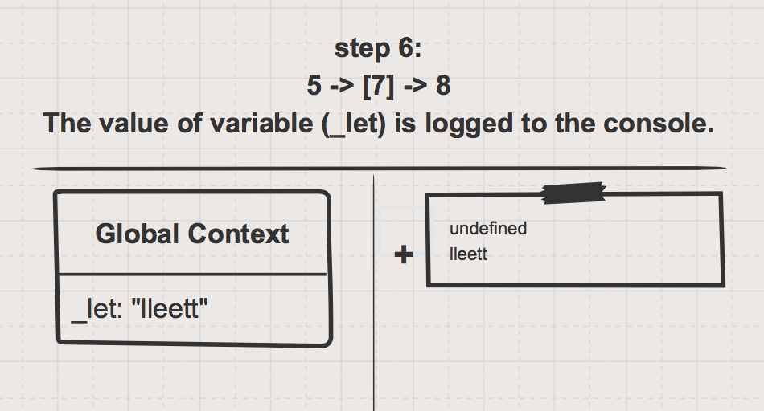

## Hoisting

During the __creation phase__. the JavaScript engine will read through all of your code and create any variables declared with the "var" key word.  These _hoisted variables_ will exist before the first line of code is executed and will have the default value __undefined__.  

The practical result of hoisting "var" variables is that you can use them in your script before reaching the line where they are declared, but they will not have the value you intended.  Once you reach that line, the desired value will be __assigned__ to your variable and everything will work as expected.


Variables declared with "let" or "const" are not hoisted.  This means that if you attempt to use them before executing the line where they are declared, the JS runtime will throw an error.  This example only uses "let" to keep things shorter, but the behavior is the same for "const".


___
 
### The Code

```js
console.log(_let); // -> ReferenceError: _let is not defined
console.log(_var); // logs: undefined

let _let = "lleett";
var _var = "vvaarr";

console.log(_let); // logs: lleett
console.log(_var); // logs: vvaarr
```

[Live PyTut link](https://goo.gl/RDz7Ft)

[Parsons Practice](https://elewa-academy.github.io/parsons/examples-to-study/variables-types/hoisting.html)

___

### The Sketches





___


___
___
### <a href="http://elewa.education/blog" target="_blank"></a>

