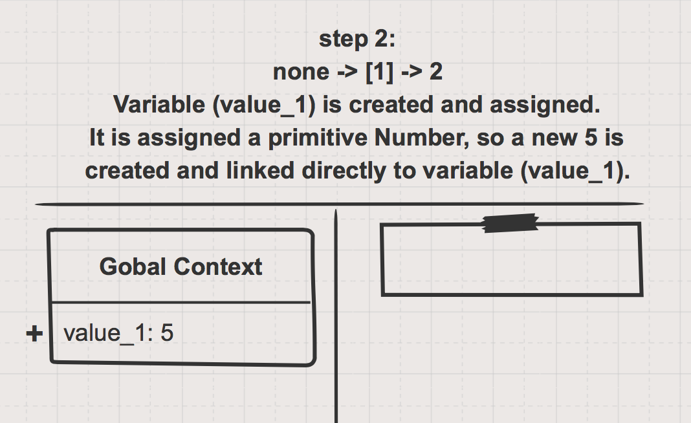
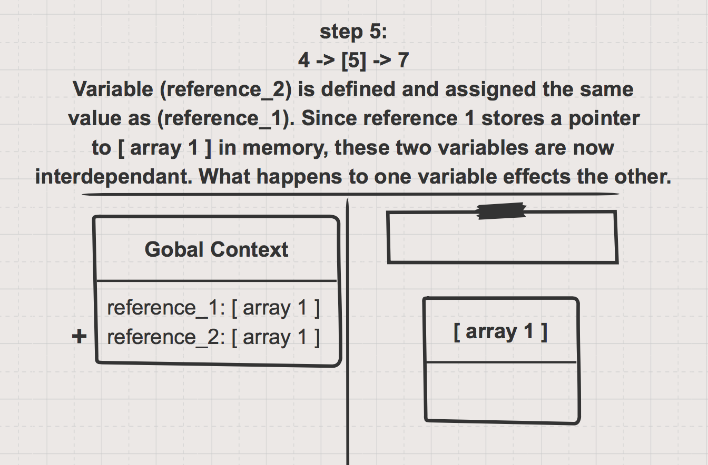

## Storing by Reference vs. Value

* "Object" is a confusing word in JS.  It can have two different meanings:
  1. Anything that isn't a primitive (arrays, functions, objects. for now).  This is because of how JavaScript handles inheritance and types behind the scenes.  Take our word for it right now, you'll learn how it works later on.
  2. The data structure defined by curly braces: {property: "value"};
* [Primitives vs Objects](https://codeburst.io/javascript-data-types-explained-347555cd2d4d)
* Storing by value:
  * Variables that are assigned primitive values directly store a copy of that value.
  * Modifying a variable's primitive value does not effect memory anywhere else in the program.
* Storing by reference:
  * Variables that are assigned object values (functions, arrays, objects) do not store their own copy of that object. They store a pointer to where that object lives in memory.
  * Modifying a variable that points to an object will immediately effect any other variable pointing to that same object.
* Side Effects:  When making a change to one piece of your program causes changes somewhere else.  We see this with the two variables __reference\_1__ and __reference\_2__.
* Garbage collecting.  If no variables are pointing to an object in memory, that object is __un-reachable__ and will be deleted from memory.


___

### The Code

```js
let value_1 = 5;
let reference_1 = [];

let value_2 = value_1;
let reference_2 = reference_1;

value_2++;
reference_2.push(value_2);
console.log(reference_1);

reference_1 = null;
reference_2 = null;
```

[PythonTutor link](https://goo.gl/EY6FjW)


___

### The Sketches








___


___
___
### <a href="http://elewa.education/blog" target="_blank"></a>

